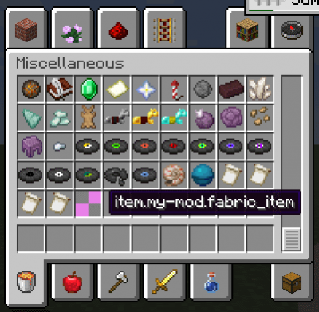

# 添加物品
## 介绍

你想要用Fabric做的第一件事就是添加一个新物品。您将需要创建一个Item对象，注册它并给它一个纹理。要向项添加其他行为，您需要一个自定义Item类。在本教程中，“wikitut”命名空间和“example_item”名称用作占位符，应替换为mod和item的相应值。

##  注册物品

首先，创建Item的实例。我们将它存储在初始化类的顶部。构造函数接受Item.Settings对象，该对象用于设置物品属性，例如库存类别，持久性和堆栈计数。

```
public class ExampleMod implements ModInitializer
{
    // an instance of our new item
    public static final Item FABRIC_ITEM = new Item(new Item.Settings().itemGroup(ItemGroup.MISC));
    [...]
}
```

要注册Item，可以在静态Registry对象上调用register。这将获取注册表类型，标识符以及您正在注册的实例。只要在初始化期间发生，就可以在任何地方调用它。

```
public class ExampleMod implements ModInitializer
{
    // an instance of our new item
    public static final Item FABRIC_ITEM = new Item(new Item.Settings().itemGroup(ItemGroup.MISC));
 
    @Override
    public void onInitialize()
    {
        Registry.register(Registry.ITEM, new Identifier("wikitut", "fabric_item"), FABRIC_ITEM);
    } 
}
```

您的新物品现已添加到Minecraft中。运行`runClient` gradle任务以查看它的运行情况



### 添加物品纹理

为物品注册纹理需要物品模型.json文件和纹理图像。您将需要将这些添加到资源目录中。每个人的直接路径是：

`  Item model: .../resources/assets/wikitut/models/item/fabric_item.json
  Item texture: .../resources/assets/wikitut/textures/item/fabric_item.png`

  请注意，wikitut是你的modid。我们的示例纹理可以在[这里](https://i.imgur.com/CqLSMEQ.png)找到。

如果您在第一步中正确注册了物品，您的游戏将以类似于此的方式抱怨缺少纹理文件：
```
 [Server-Worker-1/WARN]: Unable to load model: 'wikitut:fabric_item#inventory' referenced from: wikitut:fabric_item#inventory: java.io.FileNotFoundException: wikitut:models/item/fabric_item.json
 ```

 它可以方便地告诉您它找到资产的确切位置 - 如有疑问，请查看日志。

基本物品模型模板是：

```
{ 
  “parent” ： “item / generated” ，
  “textures” ： { 
    “layer0” ： “wikitut：item / fabric_item” 
  } 
}
```

物品的父级会更改其在手中的呈现方式，并且对于清单中的块物品等内容非常有用。“item / handheld”用于从纹理左下方保留的工具。textures / layer0是图像文件的位置。

最终纹理结果：


### 创建Item类

要为项添加其他行为，您需要创建一个Item类。默认构造函数需要Item.Settings对象。
```
public class FabricItem extends Item
{
    public FabricItem(Settings settings)
    {
        super(settings);
    }
}
```
一个示例应用程序是当您单击它时使物品播放声音：
```
public class FabricItem extends Item
{
    public FabricItem(Settings settings)
    {
        super(settings);
    }
 
    @Override
    public TypedActionResult<ItemStack> use(World world, PlayerEntity playerEntity, Hand hand)
    {
        playerEntity.playSound(SoundEvents.BLOCK_WOOL_BREAK, 1.0F, 1.0F);
        return new TypedActionResult<>(ActionResult.SUCCESS, playerEntity.getStackInHand(hand));
    }
}
```


将旧Item对象替换为新Item的实例：

```
public class ExampleMod implements ModInitializer
{
    // an instance of our new item
    public static final FabricItem FABRIC_ITEM = new FabricItem(new Item.Settings().itemGroup(ItemGroup.MISC));
    [...]
}
```

如果你正确地完成了所有事情，那么使用该物品现在应该发出声音。