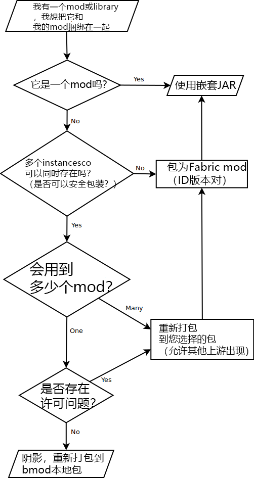

# Loader 0.4.x and You!
本教程列出了将mod更新到Loader 0.4.x（以及更高版本！？）时需要了解的内容。
## 架构更改

架构有所改变。在整个0.4.x中，将支持schemaVersion 0，但是对于0.5.x及更高版本没有这样的承诺。

有用的来源：
> * [fabric.mod.json](./documentation/fabric_mod_json.md)格式
> * 示例mod，应该立即更新（更新提交）

## 嵌套的JAR
关于嵌套JAR的用途存在很多混淆。

嵌套JAR 是：

> * 提供Fabric模式形式的依赖关系的解决方案，允许加载器选择匹配给定modpack的依赖关系的最佳版本，
> * 一个解决方案，允许您将库转换为Fabric mods，避免冲突不干净，或者有充分的理由让Fabric mod开发人员成为权威的版本控制源，
> * 在一个“组合”JAR中干净地打包mod的子项目/子模块的潜在解决方案，同时也允许单独使用它们。
嵌套的JAR 不是：

> * 意味着用于非mod Java库，
> * 始终是图书馆的最佳解决方案，可以安全地在不同的包装下进行阴影处理。请记住，Fabric mod ID只能存在一次，这意味着潜在的版本冲突可能会阻止加载包 - 

有疑问，请参考这个有用的图表：

## 不兼容性
> * 如果您的mod使用插件加载器，请放弃它并采用入口点系统。